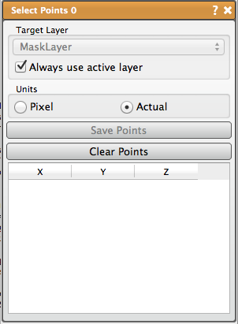

# Select Points

Select and export a set of points.

## Detailed Description

This tool selects a set of points either in pixel or actual (world) coordinates and save as a text file. It works with either data or mask layers. Clicking on a layer in one of the 2D views places a point. Secondary (*right mouse* button) click deletes a point.

