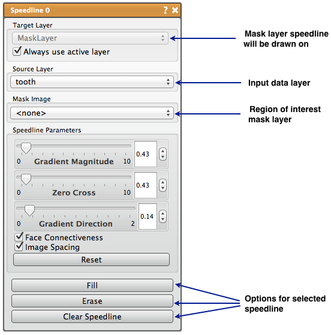

# Speedline

The Speedline tool is similar to the Polyline tool in that you use lines to identify a region to segment, but the Speedline tool attempts to alter that path between set points to find edges in the image data.

## Detailed Description

The Speedline tool, which is based on the [Live-Wire algorithm](http://www.insight-journal.org/browse/publication/230), is similar to the Polyline tool in that you use lines to identify a region to segment, but the Speedline tool attempts to alter that path between set points to find edges in the image data. The Speedline tool computes the shortest path from a source to a target pixel using a cost function that uses the following parameters, which can be found in the tool interface: *Gradient Magnitude* (image gradient), *Zero Cross* (image zero-crossings), *Gradient Direction* (boundary smoothness constraint). The *Face Connectiveness* option is used to toggle the use of a local neighborhood. The *Image Spacing* option is used to toggle the use of a neighborhood weighting scaling factor.

The primary input of the Speedline tool is a mask layer which will be altered. The second input is a data volume. Smoothing the input data volume is recommended before using the Speedline tool. An additional mask input can be used to constrain the Speedline to a given region of interest. Now the Speedline selection can begin.

The selection of the the Speedline is virtually identical to the selection of a Polyline. The user will place points and the software will create a shape with those points. In the Speedline case, a new point will be ordered to create as smooth a shape as possible, and the path of the connection will attempt to follow high intensity regions of the speed image (edges of the original image). Once the desired shape is created, the user can fill the region, or erase it to the mask layer input.

It should be noted that if the active slice changes, the points will not change, but the connections will still attempt to follow the edge regions of the images. This can therefore be used to segment multiple slices quickly if the slices do not dramatically change. The Speedline points can be cleared or reset in the tool window. The user can also set the iterations and termination value to use in the path selection algorithm.

```{list-table} Keyboard and Mouse Actions for the Speedline Tool
:name: table-speedline-actions
:widths: 25 75
:width: 100%
:header-rows: 1

* - Action
  - Function

* - left mouse
  - add or move point

* - right mouse
  - erase point

* - F
  - Paint flood fill

* - E
  - Erase flood fill

* - C
  - Clear Seed points

```


