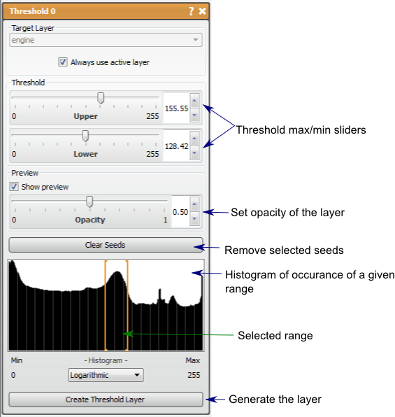

# Threshold

This tool generates a mask label from an image data volute and the value range to select.

## Detailed Description

The Threshold tool generates a mask label from an image data volume and the value range to select. The mask layer created will be a segmentation of the regions in the image data that have intensities in the range specified. This is one of the most basic semi-automatic tools used in segmentation as it is fast but can also separate contrasted regions very effectively.

The threshold range can be set in two ways: the slider provided in the tool window will set the maximum and minimum for thresholding or seed points can be placed throughout the volume and the values at those points will set the range to threshold. A preview of the threshold regions will be displayed in the 2D viewers (can be disabled in the tool window). The opacity of this preview can be set using the provided slider. The threshold range will also be shown with the image histogram in the tool window. The threshold range and histogram can also be based on a logarithmic scale (more homogenous) or linear scale.

Using the Threshold tool can provide a very good rough segmentation of the region of interest, but may require some editing. The Paint Brush and Polyline tools are manual ways to remove excess regions in the mask, but the user should also try other mask filters such as Connected Component and Connected Component Size (and another Threshold) to remove stray regions of selected noise.

```{list-table} Keyboard and Mouse Actions in the for the Threshold Tool
:name: table-threshold-actions
:widths: 25 75
:width: 100%
:header-rows: 1

* - Action
  - Function

* - M
  - toggle visibility of the preview mask

```


