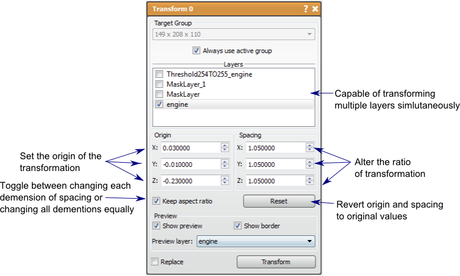

# Transform

This tool can be used to translate and scale one or more layers.

## Detailed Description

The Transform tool can be used to translate and scale one or more layers. This tool can be used on both mask layers and image data layers. This tool allows the user to change the origin (translate) and the spacing (scale) of multiple layers in a group. A key use of this tool is to manually transform one layer to match the origin and spacing of a different group, thus including the layer in that group.

The origin and spacing can be changed in the fields provided, or editing the box widget in the 2D viewer. To change the box widget, **left mouse** click and drag in the middle to move the origin, **left mouse** click and drag on the edge to change the spacing. The aspect ration of the spacing can be fixed (*Keep Aspect Ratio* option) or the spacing dimension can change independently. The Transform parameters can also be reset so that the original origin and spacing are displayed.

A preview of one of the checked layers from the list will be shown in the 2D viewer, as well as the box widget. Both these can be hidden by unchecking the *show preview* and *show border* options, respectively. If more than one layer is checked, you may choose which layer to preview with the drop down menu provided.

