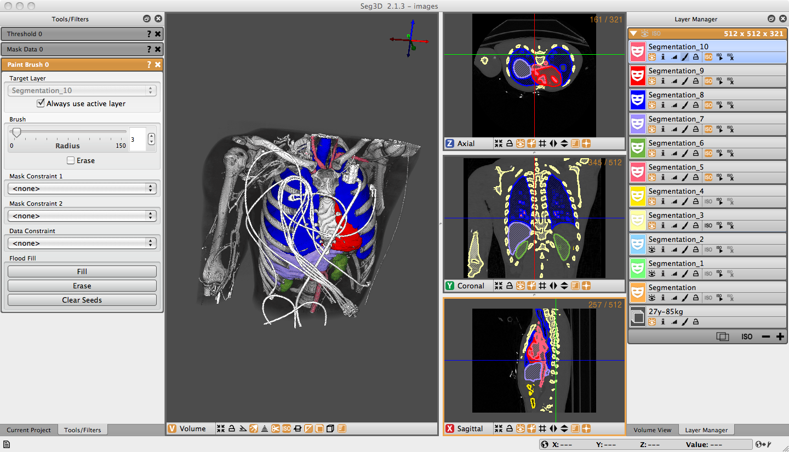

Basic Functionality
===================

This document is meant as a basic reference and walkthrough of the Seg3D layout and functionality. Specifically, every feature of the software will be addressed in a brief manner. Tool and filter documention are found in the :doc:`Seg3D Tool Documentation <tools>`.
Note: If you are looking for a refresher on the available keyboard and mouse shortcuts, there is a list under the **Help** menu of the Seg3D.

About Seg3D
-----------

    Seg3D in use.

Seg3D is a lightweight software tool developed for use in visualizing and segmenting image data. The core intended use of Seg3D involves loading 3D scalar data, such as MRI or CT scans, and generating labels mask to identify various regions of interest in the original image data. Seg3D facilitates the process using interactive tools such as image processing filters and manual masking techniques.

In addition to manual segmenting, the current version of Seg3D includes some features that facilitate automated segmenting. Provenance is a recently added feature which tracks the steps used to create label masks. This feature allows the user to then repeat the same sets with different parameters using the Python and Controller windows. Future extensions of these capabilities will allow for scripting in the terminal and porting to other programs such as SCIRun and VisTrails.

Seg3D is an crucial element of our software suite also involving BioMesh3D and SCIRun that make possible the development of image based computational models. Label masks generated with Seg3D are used in other software for such applications as 3D visualization or computational modeling. BioMesh3D requires a segmentation like those from Seg3D to generate high quality, multi-material computational meshes. SCIRun is a modular problem solving environment that generates and runs visualization and simulation tasks on segmentations from Seg3D and meshes from BioMesh3D. This interaction makes Seg3D a key step in image based modeling.

Software Requirements
---------------------

Seg3D is distributed as a binary download for Linux, Windows, and OS X. Please visit the `SCI software portal <https://github.com/SCIInstitute/Seg3D.git>`_ to download the latest `Seg3D binary <https://github.com/SCIInstitute/Seg3D/releases>`_.

Functions:
----------

.. toctree::
   :maxdepth: 2

   Manuals/Functions/BasicProgramFunctions/index
   Manuals/Functions/Seg3DViewer/index
   Manuals/Functions/Seg3DWindows/index
   Manuals/Functions/WelcomeScreen/index
